# AIRLINES DELAYS CODE CHALENGE


### 1. DATA ARCHITECTURE

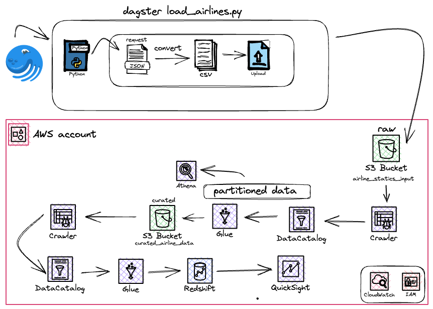

### 2. CHALLENGE
- 1. You are required to pull all records from the airline delay dataset available here:
[Airlines Json](https://think.cs.vt.edu/corgis/datasets/json/airlines/airlines.json)

- 2. You should write a Dagster pipeline to load data from the JSON file above as partitioned CSV or JSON lines files in S3. 
  -  You can use Dagster cloud’s free trial period or install Dagster locally.
1. To check if the step above worked, try querying the files using AWS Athena.

2. Next, build a Glue job to load the S3 data into Redshift.
   
3. Finally, build visualizations in Quicksight by querying Redshift to answer:
- <b> a. Which airports have the highest number of canceled flights? </b>
- <b> b. Which airports have the highest average delay?</b>
- <b> c. Which airports have the highest average delay per delay cause?</b> e.g. Late
aircraft, weather, or security. Use a filter to be able to change the delay cause.


### 3. THROUGH THE SOLUTION 

##### 3.1 DAGSTER PIPELINE
<p> I started installing Dagster locally and writing my pipeline to send data to S3. I used 3 assets and 1 job.</p>

<b>1. I created the method: </b> 

```get_json_data()``` 

 - <p>To get the json through requests python package</p>

<b>2. I created the method: </b> 

```convert_airline_json_to_csv()``` 

 - <p>To convert the json file to a csv file creating a dataframe and then converting to csv file, using Pandas library.</p>

<b>3. I created the method: </b> 

```upload_json_to_s3_pipeline()``` 

 - <p>To receive the csv data and call send_airline_data_to_s3 method</p>

<b>4. I created the method: </b> 

```send_airline_data_to_s3()``` 

 - <p>To send the csv file to S3 using boto3 AWS SDK for python, first configuring the client with the os package to protect the cloud credentials mantaining on virtual environment and then putting the object, before that I needed to create a bucket in S3 and provide the name</p>
<b>5. Then I started the Dagster interface using dagit </b>
```dagit -f load_airline.py``` 

<b>6. I went to my browser and navigated to http://localhost:3000/</b>
<b>7. In the Dagster Interface I went to Launchpad and clicked on Launch Run</b>
    <b> 7.1 The Pipeline: </b>
    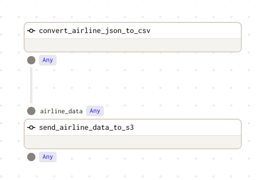
    <b>Job Run:</b>
    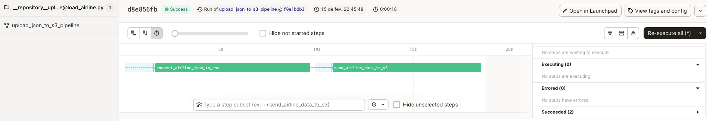

##### 3.2 AWS SERVICES
<p><b>IMPORTANT!</b> - To be able to send data from dagster to S3, I needed to create a role in IAM to provide this access. 

- <p>The data was correctly sent to my bucket in S3 called <b>'airline_statistics_input'</b></p>

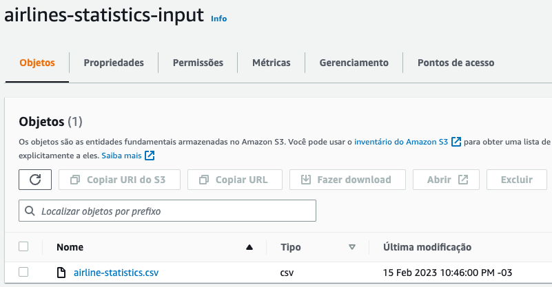
- <p>Then I went to Glue to continue this ETL process, I created a crawler to make the part of the <b>E</b> in ETL, created the table definitions in Data Catalog with the data, and which was possible to see the correct data with Athena.</p>

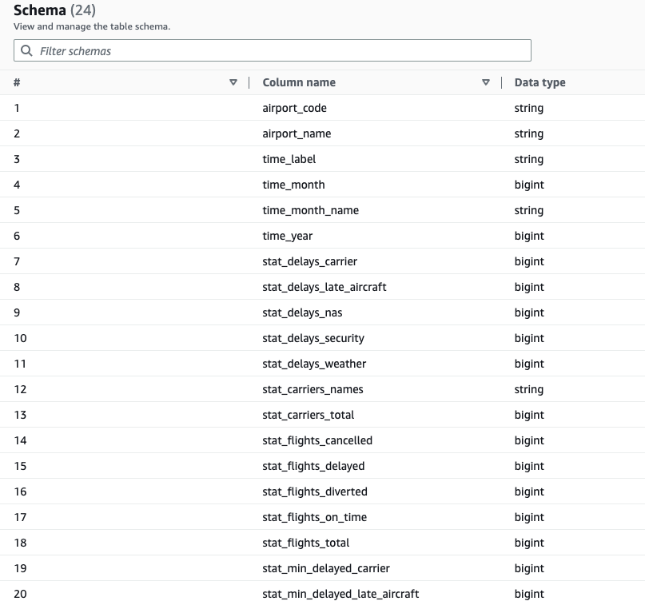
- <p>Then I created a glue job to send this partitioned data curated to s3, in a new bucket, which I called <b>curated_airline_data</b>

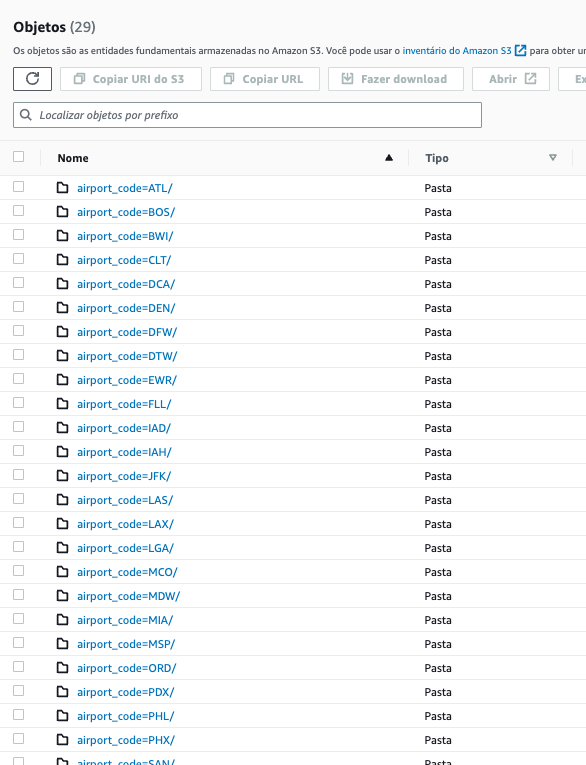
- <p>Then I remake the process created two crawlers, one to catch this partitioned data and created a Data Catalog with it and the other to be possible to create the glue job mapping the source (the one) and the target (the second) that was a table in Redshift.

- <p> Created an Amazon Redshift cluster (free option), had to set some policies and roles to be able to have access to these services, needed to configurate somethings in the VPC (Like endpoints and security groups) and created connection using my JDBC URL between glue and Redshift to make a glue process and be possible to transfer the data that was in the Data Catalog to DW Redshift</p>
- <b>Glue Job S3 to Redshift</b>
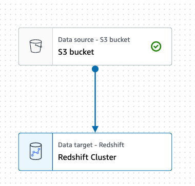
<hr>

- <b>Redshift Query</b>
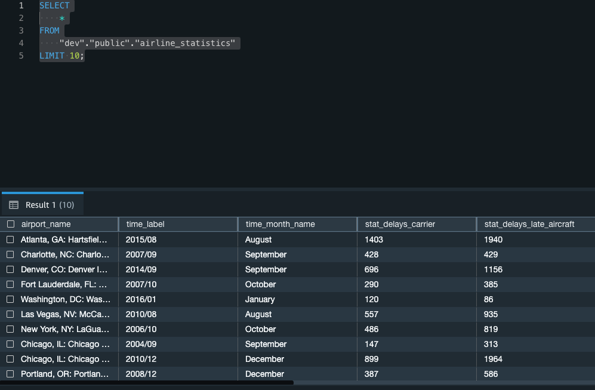

- <p> Then I created an account in Quicksight, needed to configurate VPC connection and security groups providing the region CIDR to be able to access this service and connect to Redshift and create the DataViz to answer the questions that the challenge proposed.</p>
  
Answering the questions:

<b> Q1: Which Airports have the highest number of canceled flights? </b>
<b> A1: The top 3 were: 
  - <b> 1. Chicago O'Hare International/Chicago with almost 150k canceled flights;
  - <b> 2. Hartfield Jackson Atlanta International/Atlanta with a bit more than 85k and; </b>
  - <b> 3. Fort Worth International/Dallas - TX with a little bit more than 80k </b>
<hr>

<b> Q2: Which Airports have the highest average delay? </b>
<b> A2: The top 3 were the same above: 
  - <b> 1. Chicago O'Hare International/Chicago with the total of 435k minutes of delays from 2003 to 2016 ;
  - <b> 2. Hartfield Jackson Atlanta International/Atlanta with the total of 406k minutes of delays seeing 13 years of data; </b>
  - <b> 3. Fort Worth International/Dallas - TX with the total of 258k minutes of delays between 2003 to 2016</b>
  
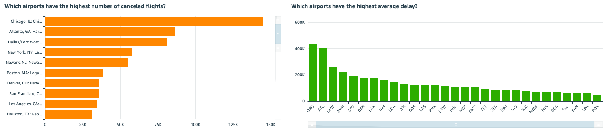

<hr>

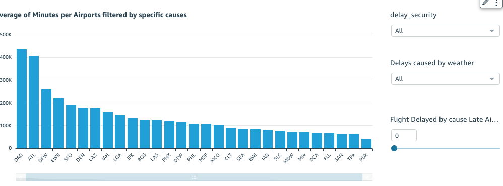

<b> Q3: Which airports have the highest average delay per delay cause? e.g. Late
aircraft, weather, or security. Use a filter to be able to change the delay cause. </b>
<b> A3:  

 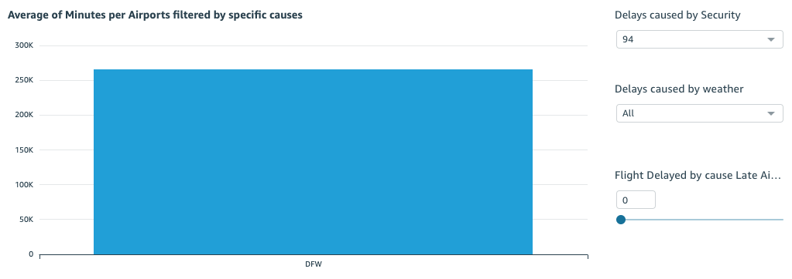
  - <b> Security. Fort Worth International/Dallas with 94 delays because of Security;
 
 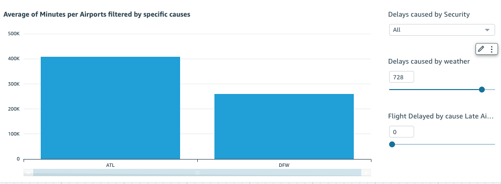

  - <b> Weather. Hartfield Jackson Atlanta International/Atlanta with 812 delays because of Weather; Dallas with 729 </b>

 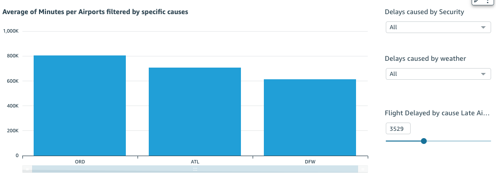
  - <b>Late Aircraft. Hartfield Jackson Atlanta International/Atlanta and Chicago O'Hare International/Chicago with more than 3,5k delays because of Late Aicraft</b>
 
<hr>

<p>PS 1: During this process CloudWatch and IAM were my best friends hahaha</p>

<b>PS 2: If you have any curiosity about Dagster. I created this project: [Dagster Beginner Project](https://github.com/jess197/learning-dagster)</b>


### 4. PROBLEMS FACED DURING THE RESOLUTION 
1. My major problem in this project was facing a type of permission that I didn't knew that was necessary to Glue access S3 and catch data to send to Redshift and this link helped me a lot: 
    - [S3 Permission](https://help.mypurecloud.com/articles/create-iam-resources-for-aws-s3-bucket/)
    - I even opened a stack overflow question, that I must answer later, because I was out of any clue about what was happening and my AWS Billing was sad :'(
    - [Stack Overflow Question](https://stackoverflow.com/questions/75462854/aws-glue-job-from-s3-bucket-to-redshift-throws-no-such-bucket)
  
2. I had some problems with VPC and security group (Redshift and Quicksight) but it was easily than this one above. 
3. My aproach to convert the json to csv, was because a problem that I encountered and didn't find any solution. That was: When I crawled the data to data catalog it went just a column called array and didnt make the table definitions corretly, so to not lose time my option was convert to csv. 


### 5. TECH STACK 
- Python
- Dagster Orchestrator 
- Dbeaver
- AWS: 
   - S3
   - Glue Crawler
   - Glue Data Catalog
   - Glue Job
   - Athena
   - DW Redshift
   - QhickSight 
   - VPC
   - CloudWatch
   - IAM


